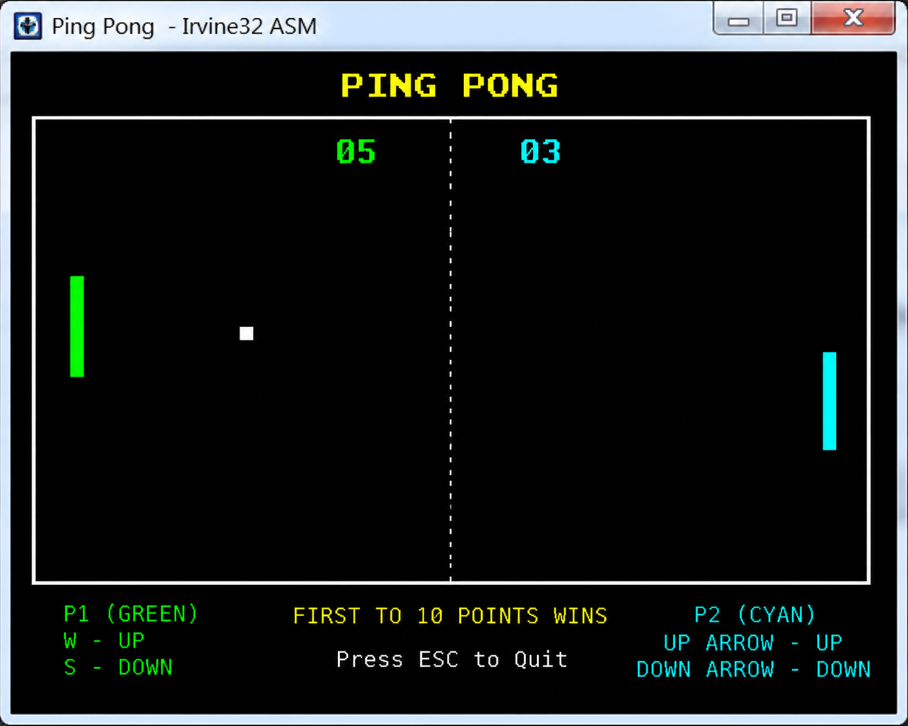

# 🏓 Ping Pong – x86 Assembly Game  

  

  
  
  

<h3 align="center">⚙️ MASM + Irvine32 | Console-Based Pong Game</h3>

---

## 🟣 Overview  

A fully functional **console-based Ping Pong (Pong-style) game** built using **x86 Assembly Language** with the **Irvine32 library**.

This project demonstrates low-level programming concepts including **real-time input handling, game loops, collision detection, and memory management**.

---

## 🔵 Key Highlights  

- Real-time keyboard input (polling)  
- Manual game loop implementation  
- Low-level rendering using cursor positioning  
- Smooth gameplay in console environment  

---

## 🟣 Features  

- 🏓 **Two-Player Mode**  
- 🎯 **Real-Time Paddle Control**  
- ⚡ **Dynamic Ball Movement (Physics-based)**  
- 🧱 **Collision Detection (Walls & Paddles)**  
- 🎚️ **Difficulty Levels (Easy / Medium / Hard)**  
- 📊 **Scoreboard & Speed Display**  
- ⏸️ **Pause / Resume System**  
- 🔁 **Replay & Menu Navigation**  

---

## 🔵 Controls  

### 🎯 Players  

| Player   | Move Up | Move Down |
|----------|--------|-----------|
| Player 1 | `W`    | `S`       |
| Player 2 | `I`    | `K`       |

---

### ⚙️ Game Controls  

| Action   | Key     |
|----------|--------|
| Pause    | `SPACE` |
| Resume   | `ENTER` |
| Replay   | `R`     |
| Menu     | `ESC`   |

---

## 🟣 Concepts Used  

- x86 Assembly Programming (MASM)  
- Game Loop Design  
- Keyboard Input Handling (Polling)  
- Collision Detection Logic  
- Console Rendering (Cursor Movement)  
- Register & Memory Management  

---

## 🔵 Tech Stack  

- 🧩 MASM (Microsoft Macro Assembler)  
- 📚 Irvine32 Library  
- 🖥️ Visual Studio  
- ⚙️ x86 Architecture  

---

